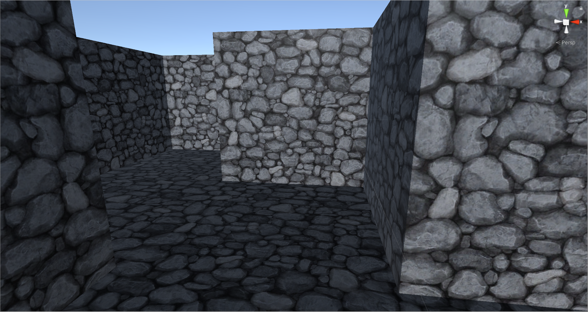

# 3D Mazes Models Generator
Procedural generated mazes 

The classes MazeGenerator and MazeGeneratorEditor connect the maze generator with the Unity3d Editor.
Class Diagram:

Here an screenshot of a maze

Here an screenshot of a maze in Unity3d Editor

